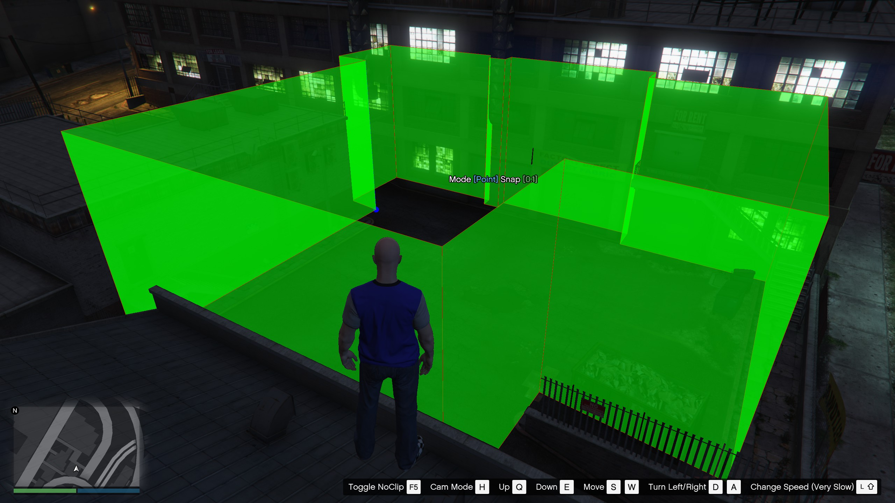
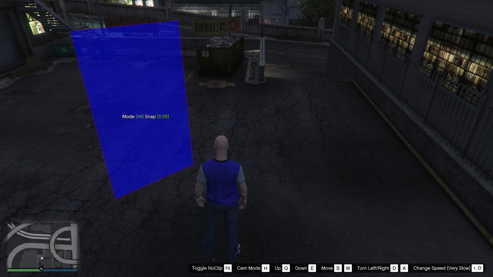
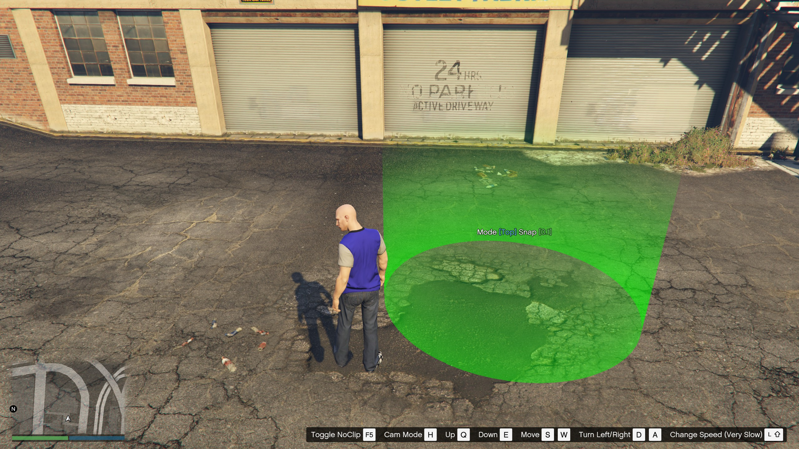

# VZones

This resource brings a polyzone system. It allows to create multiple types of zones, which can be used for various purposes. 

The resource is an extracted module from my framework, which was intended for RP usage, but since it was discontinued I've decided to make it public, because I spent so much time on it and I hope it still can be useful for someone :) Unfortunately since the whole framework was intended to be written in C#, the usage from JS is very limited, I've tried to do at least some, but still, preferred way to use this resource is from C# directly.

### Zone types

- `Zone3` (standard) 3D zone with polygonal base and height, can trigger enter and leave events for players. 
    <details>
        <summary>Zone3</summary>
        
    </details>
- `Zone2` 2D zone (Wall) with only 2 points. Can trigger event when player crosses this zone.
    <details>
        <summary>Zone2</summary>
        
    </details>
- `CylZone` a cylinder shaped zone, like classic GTA checkpoints, can trigger same events as `Zone3`.
    <details>
        <summary>Cylzone</summary>
        
    </details>

## Usage

### As C# library for your own resource (Recommended)
1. Simply add this resource from Nuget to your projects, both server and client packages needed. You can explicitly include shared package to your shared project too, but there is no need for that.
2. Create instance for main class on each side 
3. Configure property ``GlobalChecking`` (explained bellow) and `WebhookUrl` (Discord channel webhook, used for exporting zones from editor) on server-side.
4. Call ``OnStart`` on the instance
    ````csharp
   // client example
    using MarcusCZ.AltV.VZones.Server;
    
    namespace YourResource.Server;
    
    // your resource main class
    public class Class1 : Resource
    {
        private VZonesServer _zones;
        
        public override void OnStart()
        {
            _zones = new VZonesServer();
            _zones.GlobalChecking = true;
            _zones.WebhookUrl = "<discord channel webhook url>";
            _zones.OnStart(); // required
            // Now you can use static access from everywhere
            VZonesServer.Zones.RegisterZone(...);
        }
        
        public override void OnStop()
        {
            _zones.OnStop();
        }
    }
    ````
    Same must be done on Client side with ``VZonesClient`` class (No configuration needed here).

5. Directly use C# API methods from ``VZonesClient.Zones`` or `VZonesServer.Zones`. Explained bellow.

### As standalone resource and use Emit calls
1. Download standalone resource version from releases. (C# Module on server needed)
2. Set ``discord_webhook`` in `resource.toml` (Discord channel webhook, used for exporting zones from editor). Optionally disable `global_checking` (Explained bellow).
3. Enable this resource before your resource in `server.toml`
4. Use emit calls either from C# or JS. Explained bellow in **Using event emits**

## Zone editor

Two methods to manage editor:
- Client command line `zones <zone3|zone2|cylzone> <zone name>`. Available only if debug mode is enabled in `altv.toml`.
- Emit from server event `player.Emit("vzones:editor", "<zone2|zone3|cylzone>", "<zone name>")`.

### Editor keyboard shortcuts

- `HOME` - Mode selection
- `END` - Snap selection
- `INSERT` - Creates new point at current point position *Only for Zone3*
- `DELETE` - Removes current point *Only for Zone3*
- `PAGE_UP/PAGE_DOWN` - Selection of next/previous point or wall (depends on mode).
- `Arrows`

### Modes

| Mode      | Description                                    | PageUp/PageDown      | Arrows                                                                     |
|-----------|------------------------------------------------|----------------------|----------------------------------------------------------------------------|
| Point     | Work with single point                         | Select next/previous | Move with point *                                                          |
| Wall `**` | Working with wall (2 points)                   | Select next/previous | Move with wall *                                                           |
| Bottom    | Working with base<br/>Changes zone Z position  | /                    | UP/DOWN - Move zone up/down<br/>LEFT/RIGHT - Rotate zone around its center |
| Top       | Work with zone ceiling<br/>Changes zone height | /                    | UP/DOWN - Changes zone height                                              |
| All       | Work with whole zone                           | /                    | Move with whole zone *                                                     |

`*` Movement is always relative to game camera rotation.
`**` Only for `Zone3`.

**Snap** - step, movement resolution,... Specifies how much current point/wall/base moves, by one step.

### Zone export

Exports current zone as a csharp code or json object to Discord channel.

- Command line: `zones export <type>`
- Emit `player.Emit("vzones:editor", "export", "<type>");`

Types are `cs` (csharp) or `json`

#### Editor leave
- `zones exit`
- `player.Emit("vzones:editor", "exit", "");` *The second argument is also required, even if it's value doesn't matter!*

**NOTE**: NO UNDO FOR THIS ACTION!

# Zone registration

Zones can be registered both on clientside or serverside independently (Zones registered on client can be checked and managed only from client, zones registered on server can be checked and managed only from server).

## Directly using C# API

Example of registering Zone3 with enter and leave events.
```csharp
VZonesClient.Zones += new Zone3("My zone", 32.10f, 10.0f, [
    new (205.99983f, -927.04193f), // Points coords
    new (205.99117f, -929.04694f),
    new (203.99117f, -929.04694f),
    new (203.99117f, -927.04694f)
])
{
    Active = true, // will be explained later
    OnEnter = zone =>
    {
        Alt.Log($"Local player entered zone {zone.Name}");  
    },
    OnLeave = zone => { ... }
};

// or from json
string jsonText = File.ReadAllText("zone.json");
Zone2 myZone = ZoneConvert.FromJson<Zone2>(jsonText);
myZone.Active = true;
myZone.OnCross = zone => 
{
    Alt.LogInfo($"Local player crossed zone {zone.Name}");
};
VZonesClient.Zones += myZone;
```
**NOTE**: On both sides, events are triggered by zone checker, which runs in it's own thread (Task), in case of calling natives from this, you should use `AltAsync.RunOnMainThread(() => Alt.Natives.SomeNative());`

### Full API reference for ClientZoneManager
<details>
  <summary>Methods</summary>

  ````csharp
  public void RegisterZone(IActiveZone zone);
  public void UnregisterZone(string zoneName);
  public static ZoneManager operator +(ZoneManager zoneManager, IZone zone);
  public static ZoneManager operator -(ZoneManager zoneManager, string name);
  public IZone? GetZone(string name);
  public IEnterableZone? GetZone3At(Vector3 location); // Returns Zone3 or CylZone at location
  public List<IZone> GetClosestZones(int n); // get closest zones around player
  public List<IZone> GetClosestZonesAtRange(int n, float range); // get closest zones around player, range limited
  public List<IActiveZone> GetClosestActiveZones(int n);
  ````
</details>

## Advanced server-side registration with C# API
On server side, zone checking can be more complex and versatile than on client side. Each player can be tracked by unique set of zones.

### Global Checking option
This option specifies if all players will be automatically tracked, after join, by globally registered zones. If false, players will be only tracked by their own set of zones. Json loading is also supported.

### Registering global zones
This is very similiar to first example above.
````csharp
// NOTE the += is only shortcut for method VZonesServer.Zones.Register(IZone zone)
VZonesServer.Zones += new CylZone("cylinder zone", new (897.7239f, -1054.654f, 32.82369f), 2f, 5f)
{
    Active = true,
    OnEnter = (player, zone) => { ... },
    OnLeave = (player, zone) => { ... }
};
````

### Registering zones only for player
The zone will be only checked for the specified player.
````csharp
IPlayer player = ...;
Zone3 zone = ...;
VZonesServer.Zones.AddZoneForPlayer(player, zone);
````

You can also enable/disable global checking option for specific player.
````csharp
VZonesServer.Zones.EnableGlobalChecking(player);
VZonesServer.Zones.DisableGlobalChecking(player);
````

### Full API reference for ServerZoneManager
<details>
  <summary>Methods</summary>

  ````csharp
  public void RegisterZone(IActiveZone zone);
  public void UnregisterZone(string zoneName);
  public void UnregisterZone(IActiveZone zoneName);
  public void EnableGlobalChecking(IPlayer player);
  public void DisableGlobalChecking(IPlayer player);
  public void SetZonesForPlayer(IPlayer player, List<IActiveZone>? zones);
  public void AddZoneForPlayer(IPlayer player, IActiveZone zone);
  public void RemoveZoneForPlayer(IPlayer player, IActiveZone zone);
  public void ClearZonesForPlayer(IPlayer player);
  public static ServerZoneManager operator +(ServerZoneManager zoneManager, IActiveZone zone);
  public static ServerZoneManager operator -(ServerZoneManager zoneManager, string name);
  ````
</details>


## Using event emits
Only support loading zones from json files. Should also work for JS (not tested).
```csharp
// Clientside
Alt.EmitClient("vzones:register", "<type>", "<filename>", "<name>");
// type is zone3, zone2, cylzone
// filename is path and name for json file
// name is optional, if its not set name from json is used.

// Event handling
Alt.OnClient<string>("vzones:on:enter", (zoneName) => { ... });
Alt.OnClient<string>("vzones:on:leave", (zoneName) => { ... });
Alt.OnClient<string>("vzones:on:cross", (zoneName) => { ... });

// Serverside
Alt.EmitServer("vzones:register", "<filename>");

// Event handling
Alt.OnServer<IPlayer, string>("vzones:on:enter", (player, zoneName) => { ... });
Alt.OnServer<IPlayer, string>("vzones:on:leave", (player, zoneName) => { ... });
Alt.OnServer<IPlayer, string>("vzones:on:cross", (player, zoneName) => { ... });
```

On server-side classic ``File.ReadAllText()`` is used, so path is relative to server's root directory.

On client-side ``Alt.ReadFile()`` must be used
- For loading files inside `VZones/client` folder use ``/client/file.json`` as filename
- For loading files inside other resource folder use ``@resource/file.json`` as filename

# Other info

### Reason for 'Active' parameter

When I created this module for my framework, it was intended for two use cases, first handling zone events (entering, leaving specific location) and second to work with my other module VTarget (a third eye system), where each zone can provide a 'performance friendly*' invisible 'object' on which the third eye can be aimed at.

*since for this usage is not required to perform in-world graphic raycasting from natives. Raycasting is done anyway, but it shouldn't be that expensive, since it works only with positions. Code can be found in VTargetAPI project (VZonesProvider). *Maybe can someone say it's a mess anyway idk haha, no stress test was performed.*

That's where the Active parameter has usage, if its set to false, it's ignored by checking algorithm, so the zone does not 'tick', cannot fire enter/leave/cross events, but it still can be visible by VTarget.

### How checking algorithm works in a nutshell
On both sides, zones are in periodic time reordered by distance to player (to each player on server), then it's always 'ticked' N closest zones, if player is inside or not, if the state has changed, an event is fired. 

Full code can be found in ``ClientZoneManager#DoChecking`` or `ServerZoneManager#DoChecking`. These methods run in their own Task (Thread).